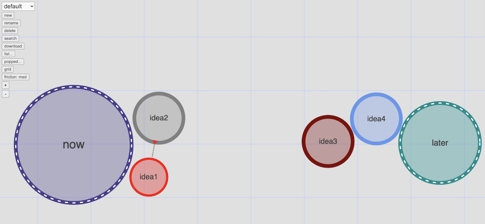
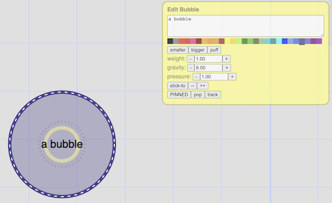

# Bubbles!

[Click here to try it.](web/bubbles.html)

When you arrive, double click somewhere over the grid a few times.  More instructions below.

## What is this?

Place bubbles, interact with them, and perhaps use them to organize your ideas.

## Instructions

* double click to create a new bubble
* click on a bubble to change its properties
* drag bubbles to move them
* drag the background to move around

## Bubble Properties

Click on a bubble to show its properties and change them.

The large white area at the top lets you edit the text shown in the middle of the bubble.

Just below that you can choose the background color.

Smaller/bigger change its size, "puff" temporarily increases its size while you hold it down
(a simple way to clear some space).

Weight, gravity and pressure are described below.

Stick-to lets you choose another bubble to connect to.  The idea is to connect subsidiary ideas
to a central concept, or just to make strange shapes.

The "PINNED" button lets you freeze a bubble in space so that it won't be jostled.  Try pinning
a bubble and then giving it some gravity.

Pop, of course, explodes a bubble.

Track causes the bubble to stay in the middle of your page.

## Properties

Bubbles can have these properties...

* gravity - attracts nearby bubbles
* pressure - i.e. air pressure, flabby or firm
* weight - how much or little it is attracted by gravity
* stuck-to - a bubble can be connected to one other bubble, by a string/spring of varying
  length
* pinned - prevents any forces from moving the bubble -- despite the name, does not
  cause it to burst

## Various Features

### Save and Restore

All bubbles are stored in the browser, which isn't a very durable place to keep them.  So
you may want to use the download button to save them properly.  To restore such a saved
file just drag it onto the window.

### Visual Search

One way to track down a bubble is to create a new bubble and tell it to go looking.
TO do this, just type "SEEK: " as the text for the bubble, followed by what you are
looking for.  It only matches whole words at the moment, and since there may be multiple
matches it will point to all of them but will move toward the 'center of gravity' of
matching bubbles.

### Track

When you click the button to track a bubble that bubble will be kept in the center of your 
view.  An untrack button is provided to get out of this mode.  'Seek bubbles' automatically
start out as tracked so that you can see what they find.

### List View

In case you need to switch to a more linear way of thinking there is a list view that
shows your bubbles in a table.  This also offers a way to find missing or misplaced
bubbles: check the boxes by the bubbles you are looking for and click 'go to'.

### Undelete

If you accidentally pop a bubble that is important to you, the list of popped bubbles is
available as a list (click on 'popped...').  At the moment, only bubbles with text are
recoverable in this way.

### Zappo Blaster

For a more dramatic or perhaps gratifying way to consider an idea completed you can also shoot
it.  Click the 'zappo' button to enable zappo blaster mode.

## Caveats

Please don't open the same page of bubbles in different tabs or windows at the same time.  That
isn't supported yet.

## Why?

For a long time I had a vague idea for organizing my thoughts using some kind of a physical
metaphor that was in some way reminiscent of my inner world.  So, naturally, bubbles floating
around in some approximately organized way seemed appropriate.
